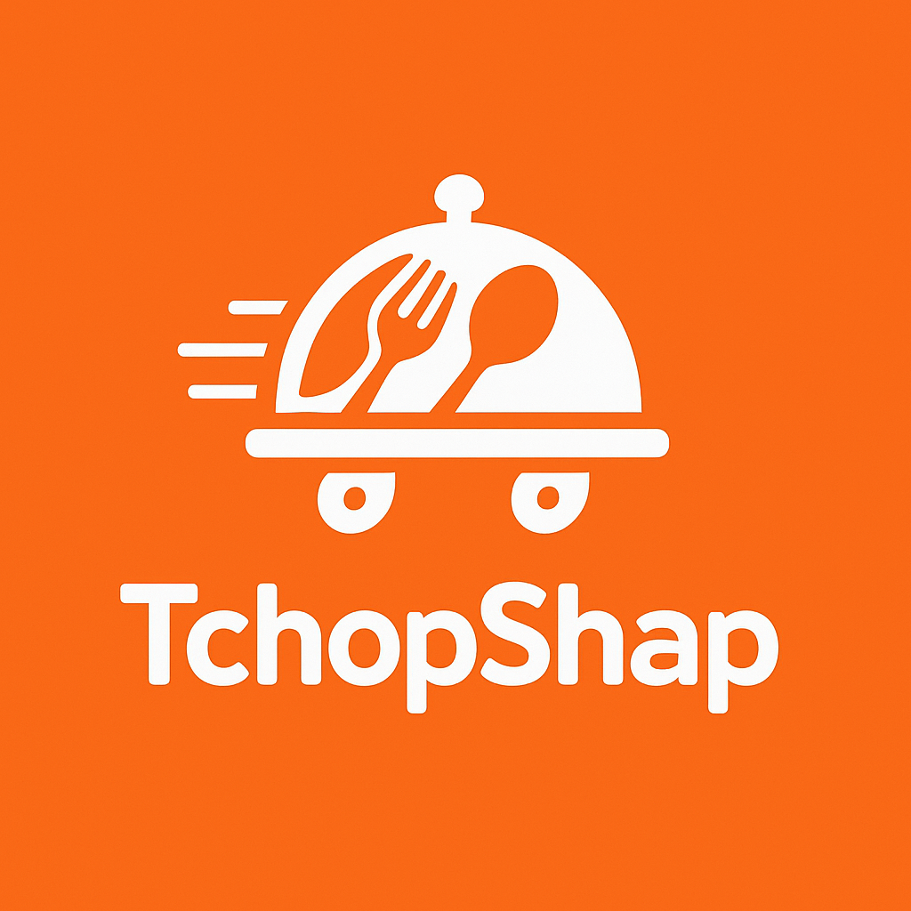
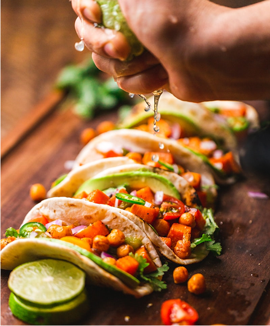

# Tutoriel rapide d’utilisation – Projet Tchopshap React

## 1. Introduction
Ce document vous guide pour installer, lancer et utiliser rapidement l’application React « Tchopshap ».

## 2. Fonctionnalités détaillées de l’application

### Pour les utilisateurs
- **Recherche de plats et restaurants** :
  - Utilisez la barre de recherche pour trouver rapidement un plat ou un restaurant par nom ou catégorie.
  - Les résultats s’affichent dynamiquement.
  
  

- **Navigation par catégories** :
  - Parcourez les plats selon différentes catégories (ex : africain, européen, etc.).

- **Consultation des restaurants** :
  - Accédez à la liste des restaurants partenaires, visualisez leurs menus et détails.
  
  

- **Ajout au panier** :
  - Ajoutez un ou plusieurs plats au panier depuis la page d’accueil, de restaurant ou de plat.

- **Gestion du panier** :
  - Modifiez les quantités, supprimez des articles, visualisez le total avant validation.
  
  

- **Espace admin** :
  - Gestion des clients, restaurants, livreurs, catégories, commandes.
  
  

### Pour les administrateurs
- **Tableau de bord admin** :
  - Vue d’ensemble des activités (commandes, clients, restaurants, livreurs).
- **Gestion des clients** :
  - Ajout, modification, suppression de clients.
- **Gestion des restaurants** :
  - Ajout, modification, suppression de restaurants, gestion des menus.
- **Gestion des plats** :
  - Ajout, modification, suppression de plats, gestion des catégories.
- **Gestion des livreurs** :
  - Ajout, modification, suppression de livreurs.
- **Gestion des commandes** :
  - Suivi, modification du statut, historique des commandes.
- **Gestion des catégories** :
  - Création, modification, suppression de catégories de plats.
- **Téléchargement de rapports** :
  - Exportation de données (clients, commandes, etc.) au format PDF ou Excel.

## 3. Prérequis
- Node.js (version 14 ou supérieure)
- npm (généralement installé avec Node.js)

## 4. Installation
1. Ouvrez un terminal dans le dossier du projet.
2. Installez les dépendances :
   ```bash
   npm install
   ```

## 5. Lancement du projet
1. Démarrez l’application en mode développement :
   ```bash
   npm start
   ```
2. Ouvrez votre navigateur à l’adresse : [http://localhost:3000](http://localhost:3000)

## 6. Navigation principale
- **Accueil** : Présentation, recherche de plats et restaurants.
- **Restaurants** : Liste des restaurants disponibles.
- **Plats** : Parcourez les plats proposés.
- **Panier** : Consultez et gérez votre commande.
- **Profil** : Gérez vos informations personnelles.
- **Admin** : (si accès) Gestion des clients, restaurants, livreurs, catégories, commandes.

## 7. Conseils d’utilisation
- Utilisez la barre de recherche pour trouver rapidement un plat ou un restaurant.
- Accédez à votre profil pour modifier vos informations ou consulter vos commandes.
- L’espace admin est réservé aux utilisateurs autorisés.

## 8. Conversion en PDF
Pour convertir ce document en PDF :
- Ouvrez-le dans un éditeur Markdown (VS Code, Typora, Dillinger.io…)
- Exportez ou imprimez en PDF via l’éditeur ou le navigateur.

---
© 2025 – Projet Tchopshap React
